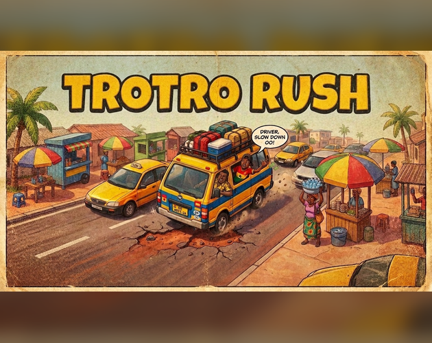
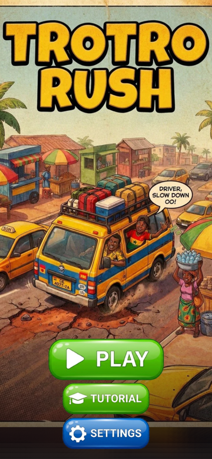
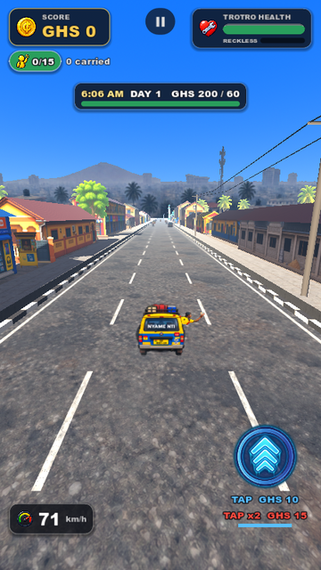
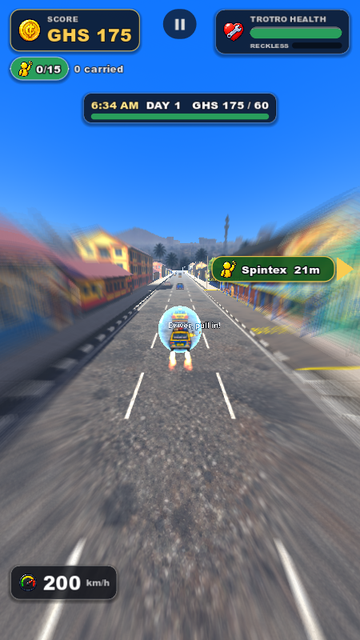
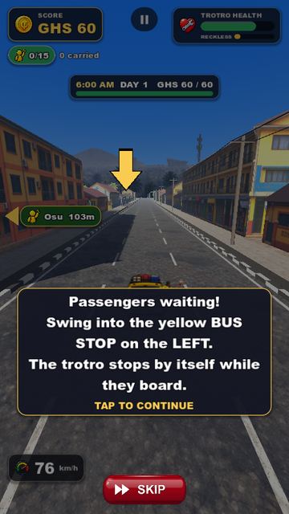

# Trotro Rush



**Trotro Rush** is an arcade driving game set on the streets of Accra, Ghana. You drive a trotro (a shared minibus) through a working day: pick up passengers at the bus stops, dodge taxis, okadas, potholes and go-slows, race rival trotros to the passenger, and hit the owner's sales target before 6 PM.

It's built with **Godot 4** for **phones, in the browser** (portrait). It also plays on desktop.

| Main menu | On the road | Full boost | Tutorial |
|---|---|---|---|
|  |  |  |  |

## Developers

- **Edward Tamakloe**
- **Nana Kow Seniagya**

## How to play

- **Steer:** hold and drag anywhere on the screen. On desktop you can also use the mouse, A/D or the arrow keys.
- **Speed:** there's no accelerator or brake. The trotro drives itself and speeds up while you drive cleanly. A crash or a police stop slows it back down.
- **Passengers:** swing into a yellow **bus stop** and the trotro stops by itself while they board. Every passenger pays a fare.
- **The day:** reach the day's sales target before 6 PM. Each day is a little shorter, and the target is a little higher.
- **Health:** crashes, potholes and hitting people hurt the trotro. A blue **mechanic** stop repairs it for GHS 15.
- **Recklessness:** speeding and near misses fill the meter. When it's full, the police pull you over and fine you.
- **Police checkpoints:** if the officer flags you, get into the coned lane.
- **Rival trotros:** they chase you for your passenger. Block them, or beat them to the stop.
- **Booster:** it pops up now and then.
  - **Tap once** for x1 (GHS 10, 130 km/h).
  - **Double-tap** for the full x2 with flames (GHS 15, 200 km/h).
  - Both come with a shield that takes four hits.
- **Tutorial:** it plays the first time you press PLAY, and you can replay it from the main menu or Settings.

## Running the project

1. Install **[Godot 4.7.2](https://godotengine.org/)**. The project uses the **GL Compatibility** renderer.
2. Open Godot, choose **Import**, and select `project.godot` in this folder.
3. The first time, Godot imports all the assets, which takes a few minutes. Then press **F5** to play.

### Web build

The game is made to run in a phone browser:

```bash
godot --headless --path . --export-release "Web" "build/web/index.html"
```

`tools/web/` has the custom loading page (cover art, a loading bar with a trotro, and the music and street sounds streamed alongside the game), plus scripts to pack the build for hosting:

- `pack_web.py` splits the build for hosts with a per-file size limit.
- `pack_itch.py` makes a single zip for **itch.io**.

See `tools/web/README.md` and `docs/ITCH_PAGE.md`.

## Project layout

| Folder | What's in it |
|---|---|
| `scenes/` | Godot scenes: the world, the player's trotro, traffic vehicles, road segments |
| `scripts/` | All the game code (GDScript): driving, traffic, passengers and stops, road events, police, the rival, the booster, HUD and menus, tutorial, sound |
| `assets/` | Art (buildings, vehicles, characters, props, environment, UI and buttons), music, street-sound recordings, voice callouts |
| `docs/` | Game design spec (`GAME_SPEC.md`, `GAMEPLAY_SPEC.md`), current status and tuning notes (`STATUS.md`), itch.io page guide |
| `tools/` | Web export and packing scripts, the image generation tool used for some artwork, the trailer tool |

The main gameplay numbers (speeds, damage, day length, targets, fares, the rival's difficulty, booster prices) are listed in the **Tuning knobs** table in `docs/STATUS.md`.

## Audio

- **Music:** "Griot Strings" plays on the menus, and "Savanna Drive" while driving.
- **Street background:** recordings of Accra streets, quiet, busy and in between, play softly under the music.
- **Voices:** the trotro mate's calls, the passengers at the bus stops and the roadside fitter.

The music, street recordings and voices are the developers' own. The game's other effects (engine, crash, pothole, siren) are synthesised in code (`scripts/sfx.gd`). Any file dropped into `assets/audio/sfx/` with the same name replaces the synthesised sound.

## License

Trotro Rush is © 2026 Edward Tamakloe and Nana Kow Seniagya. It has two parts with different terms:

- **Source code** (`scripts/`, `scenes/`, `tools/`, project files): **MIT License**. See [`LICENSE`](LICENSE). You're welcome to learn from and reuse the code.
- **Assets** (everything in `assets/`: voice recordings, music, sound recordings and all artwork): **All Rights Reserved**. See [`assets/LICENSE.md`](assets/LICENSE.md).
  - They're included only so the project can be built.
  - They may not be copied, reused or redistributed. In particular, the **voices may not be used** in any way, including voice cloning or AI training.
